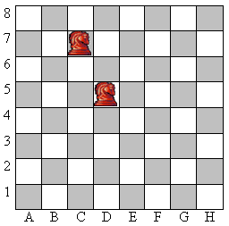

# Шахматы [⬀](https://acmp.ru/index.asp?main=task&id_task=6)

Совсем недавно Вася занялся программированием и решил реализовать собственную программу для игры в шахматы. Но у него возникла проблема определения правильности хода конем, который делает пользователь. Т.е. если пользователь вводит значение «C7-D5», то программа должна определить это как правильный ход, если же введено «E2-E4», то ход неверный. Также нужно проверить корректность записи ввода: если например, введено «D9-N5», то программа должна определить данную запись как ошибочную. Помогите ему осуществить эту проверку!

## Входные данные

В единственной строке входного файла INPUT.TXT записан текст хода (непустая строка), который указал пользователь. Пользователь не может ввести строку, длиннее 5 символов.

## Выходные данные

В выходной файл OUTPUT.TXT нужно вывести «`YES`», если указанный ход конем верный, если же запись корректна (в смысле правильности записи координат), но ход невозможен, то нужно вывести «`NO`». Если же координаты не определены или заданы некорректно, то вывести сообщение «`ERROR`».

## Примеры

<table>
<thead>
<tr><th>№</th><th>INPUT.TXT</th><th>OUTPUT.TXT</th></tr>
</thead>
<tbody>
<tr><td>1</td><td>C7-D5</td><td>YES</td></tr>
<tr><td>2</td><td>E2-E4</td><td>NO</td></tr>
<tr><td>3</td><td>BSN</td><td>ERROR</td></tr>
</tbody>
</table>
