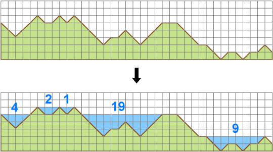

# Areas on the Cross-Section Diagram [⬀](https://judge.u-aizu.ac.jp/onlinejudge/description.jsp?id=ALDS1_3_D)

Your task is to simulate a flood damage.

For a given cross-section diagram, reports areas of flooded sections.



Assume that rain is falling endlessly in the region and the water overflowing from the region is falling in the sea at the both sides. For example, for the above cross-section diagram, the rain will create floods which have areas of 4, 2, 1, 19 and 9 respectively.

## Input
A string, which represents slopes and flatlands by `'/'`, `'\'` and `'_'` respectively, is given in a line. For example, the region of the above example is given by a string `"\\///\_/\/\\\\/_/\\///__\\\_\\/_\/_/\"`.

## output
Report the areas of floods in the following format:
```
A
k L₁ L₂ ... Lₖ
```

In the first line, print the total area `A` of created floods.

In the second line, print the number of floods `k` and areas `Lᵢ` (i=1,2,...,k)
 for each flood from the left side of the cross-section diagram. Print a space character before `Lᵢ`.

## Constraints
- 1 ≤ length of the string ≤ 20,000

## Sample Input 1
```
\\//
```

## Sample Output 1
```
4
1 4
```

## Sample Input 2
```
\\///\_/\/\\\\/_/\\///__\\\_\\/_\/_/\
```

## Sample Output 2
```
35
5 4 2 1 19 9
```
