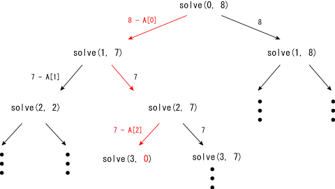

# Exhaustive Search [⬀](https://judge.u-aizu.ac.jp/onlinejudge/description.jsp?id=ALDS1_5_A)

Write a program which reads a sequence `A` of `n` elements and an integer `M`, 
and outputs `"yes"` if you can make `M` by adding elements in `A`, otherwise 
`"no"`. You can use an element only once.

You are given the sequence `A` and `q` questions where each question contains `Mᵢ`.

## Input
In the first line `n` is given. In the second line, `n` integers are given. 
In the third line `q` is given. Then, in the fourth line, `q` integers (`Mᵢ`) are given.

## Output
For each question `Mᵢ`, print `yes` or `no`.

## Constraints
- `n` ≤ 20
- `q` ≤ 200
- 1 ≤ elements in `A` ≤ 2000
- 1 ≤ `Mᵢ` ≤ 2000

## Sample Input 1
```
5
1 5 7 10 21
8
2 4 17 8 22 21 100 35
```

## Sample Output 1
```
no
no
yes
yes
yes
yes
no
no
```

## Notes

You can solve this problem by a Burte Force approach. Suppose `solve(p, t)` is a 
function which checkes whether you can make `t` by selecting elements after 
`p`-th element (inclusive). Then you can recursively call the following functions:

- `solve(0, M)`
- `solve(1, M-{sum created from elements before 1st element})`
- `solve(2, M-{sum created from elements before 2nd element})`
- ...

The recursive function has two choices: you selected `p`-th element and not. So, 
you can check `solve(p+1, t-A[p])` and `solve(p+1, t)` in `solve(p, t)` to check
the all combinations.

For example, the following figure shows that 8 can be made by `A[0] + A[2]`.


