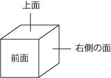

# Dice II [⬀](https://judge.u-aizu.ac.jp/onlinejudge/description.jsp?id=ITP1_11_B)

Construct a dice from a given sequence of integers in the same way as Dice I.

You are given integers on the top face and the front face after the dice was rolled in the same way as Dice I. Write a program to print an integer on the right side face.





## Input
In the first line, six integers assigned to faces are given in ascending order of their corresponding labels. In the second line, the number of questions `q` is given.

In the following `q` lines, `q` questions are given. Each question consists of two integers on the top face and the front face respectively.

## Output
For each question, print the integer on the right side face.

## Constraints
- 0 ≤ *the integer assigned to a face* ≤ 100
- The integers are all different
- 1 ≤ `q` ≤ 24

## Sample Input
```
1 2 3 4 5 6
3
6 5
1 3
3 2
```

## Sample Output
```
3
5
6
```
