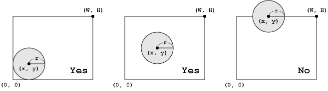

# Circle in a Rectangle [⬀](https://judge.u-aizu.ac.jp/onlinejudge/description.jsp?id=ITP1_2_D)

Write a program which reads a rectangle and a circle, and determines whether the circle is arranged inside the rectangle. As shown in the following figures, the upper right coordinate `(W,H)` of the rectangle and the central coordinate `(x,y)` and radius `r` of the circle are given.



## Input
Five integers `W`, `H`, `x`, `y` and `r` separated by a single space are given in a line.

## Output

Print `Yes` if the circle is placed inside the rectangle, otherwise `No` in a line.

## Constraints
- `−100 ≤x,y ≤ 100`
- `0 < W,H,r ≤ 100`

## Sample Input 1
```
5 4 2 2 1
```

## Sample Output 1
```
Yes
```

## Sample Input 2
```
5 4 2 4 1
```

## Sample Output 2
```
No
```
