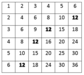

# Multiplication Table [⬀](https://codeforces.com/problemset/problem/577/A)

Let's consider a table consisting of `n` rows and `n` columns. The cell located at the intersection of `i`-th row and `j`-th column contains number `i × j`. The rows and columns are numbered starting from `1`.

You are given a positive integer `x`. Your task is to count the number of cells in a table that contain number `x`.

## Input

The single line contains numbers `n` and `x` (`1 ≤ n ≤ 10⁵`, `1 ≤ x ≤ 10⁹`) — the size of the table and the number that we are looking for in the table.

## Output

Print a single number: the number of times `x` occurs in the table.

## Examples

### input
```
10 5
```

### output
```
2
```

### input
```
6 12
```

### output
```
4
```

### input
```
5 13
```

### output
```
0
```

## Note

A table for the second sample test is given below. The occurrences of number 12 are marked bold.


