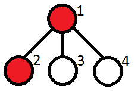
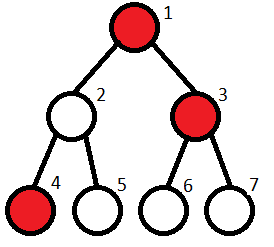

# Kefa and Park [⬀](https://codeforces.com/problemset/problem/580/C)

Kefa decided to celebrate his first big salary by going to the restaurant.

He lives by an unusual park. The park is a rooted tree consisting of `n` vertices with the root at vertex `1`. Vertex `1` also contains Kefa's house. Unfortunaely for our hero, the park also contains cats. Kefa has already found out what are the vertices with cats in them.

The leaf vertices of the park contain restaurants. Kefa wants to choose a restaurant where he will go, but unfortunately he is very afraid of cats, so there is no way he will go to the restaurant if the path from the restaurant to his house contains more than `m` **consecutive** vertices with cats.

Your task is to help Kefa count the number of restaurants where he can go.

## Input

The first line contains two integers, `n` and `m` (`2 ≤ n ≤ 10⁵`, `1 ≤ m ≤ n`) — the number of vertices of the tree and the maximum number of consecutive vertices with cats that is still ok for Kefa.

The second line contains `n` integers `a₁`, `a₂`, ..., `aₙ`, where each `aᵢ` either equals to 0 (then vertex `i` has no cat), or equals to `1` (then vertex `i` has a cat).

Next `n - 1` lines contains the edges of the tree in the format "`xᵢ yᵢ`" (without the quotes) (`1 ≤ xᵢ, yᵢ ≤ n`, `xᵢ ≠ yᵢ`), where `xᵢ` and `yᵢ` are the vertices of the tree, connected by an edge.

It is guaranteed that the given set of edges specifies a tree.

## Output

A single integer — the number of distinct leaves of a tree the path to which from Kefa's home contains at most `m` consecutive vertices with cats.

## Examples

### input
```
4 1
1 1 0 0
1 2
1 3
1 4
```

### output
```
2
```

### input
```
7 1
1 0 1 1 0 0 0
1 2
1 3
2 4
2 5
3 6
3 7
```

### output
```
2
```


## Note

Let us remind you that a tree is a connected graph on `n` vertices and `n - 1` edge. A *rooted* tree is a tree with a special vertex called *root*. In a rooted tree among any two vertices connected by an edge, one vertex is a parent (the one closer to the root), and the other one is a child. A vertex is called a *leaf*, if it has no children.

Note to the first sample test:



The vertices containing cats are marked red. The restaurants are at vertices `2`, `3`, `4`. Kefa can't go only to the restaurant located at vertex `2`.

Note to the second sample test:



The restaurants are located at vertices `4`, `5`, `6`, `7`. Kefa can't go to restaurants `6`, `7`.

