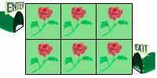

# Anfisa and the flowers [⬀](https://www.e-olymp.com/en/problems/63)



Murzik made one of flowerbeds in the form of a chess-board with the sizes m to n. Some flower grows in every cell of the flowerbed. Sometimes he took out Anfisa for a walk along this flowerbed (yes, not surprised, they are really friends). Anfisa moves on a flowerbed next way: she always starts from the upper left corner and finishes at bottom-right corner. She picks flowers and each time she passes a new route, and Murzyk give her the piece of cheese at the exit. You have to count the most number of pieces of cheese that can get Anfisa, if each time she tries to save the most of flowers.

## Input

Two numbers m and n (0 < m, n ≤ 2 * 10⁹) are given in one line.

## Output

Print the number of pieces of cheese, that Anfisa can get.

_Time limit 1 second_

_Memory limit 128 MiB_

## Input example #1
```
2 3
```

## Output example #1
```
3
```