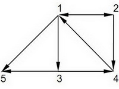

# Mountain routes [⬀](https://www.e-olymp.com/en/problems/122)

The mountain tourist resort consists of n hostels, connected with k mountain routes (other routes in mountains are dangerous). Any route between two hostels takes 1 day. The travel group, located in the hostel a, is going to go to the hostel b for no more than d days. How many different routes (without cycles) between a and b exist?



## Input

The first line contains numbers n, k, a, b, d (n ≤ 50, d ≤ 10), separated with a space. Each of the next k lines contains pair of numbers that describes the possible mountain route. All given numbers are positive integers.

## Output

Print one number - the number of routes.

_Time limit 1 second_

_Memory limit 64 MiB_

## Input example #1
```
5 8 2 5 3
1 2
1 3
1 5
2 1
2 4
3 4
3 5
4 1
```

## Output example #1
```
3
```
