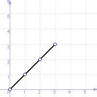

# The Segment [⬀](https://www.e-olymp.com/en/problems/136)



The segment's end points have integer coordinates. Find the number of points on a segment with integer coordinates.

## Input

Four numbers - the coordinates x1, y1, x2, y2 of the segment ends. All numbers are not greater than 2۰109 by absolute value.

## Output

Print the number of points on a segment with integer coordinates.

*Time limit 1 second*

*Memory limit 122.17 MiB*

## Input example #1

```
0 0 3 3
```

## Output example #1

```
4
```
