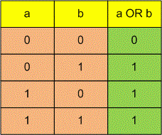

# [Black and white graphics](https://www.e-olymp.com/en/problems/458)

One of the basic tasks of computer graphics is black-and-white images. Images can be represented in the form of rectangles of width w and height h, divided into w × h unit squares, each of which is either white or black. Such individual squares are called pixels. In computer memory the images are stored in the form of rectangular tables containing zeros and ones.

In many areas very often appears the problem of combinating the images. One of the simplest combination method that is used when working with black and white images, is the per-pixel application of some logical operation. This means that the pixel value is obtained by applying the result of this logical operation to the corresponding pixels of the arguments. Logical operations on two arguments are usually given by a truth table that contains the values of operations for all possible combinations of arguments. For example, for the operation "OR", this table looks like this:



Write a program that will calculate the result of a given logical operation applied to two black-and-white images of the same size.


## Input
The first line contains two integers w and h (1 ≤ w, h ≤ 100). Following h lines describe the first image and each of these lines consists of w characters that equals to zero or one. Next given a description of the second image in a similar format. The last line contains a description of the logical operations in the form of four numbers, each of which is zero or one. The first number is the result of logical operation if both arguments are zeros, the second number is the result if the first argument is zero and the second is one, the third number is the result if the first argument is one and the second is zero, and the fourth number is the result if both arguments are ones.

## Output
Print the result of applying the specified logical operation to the images in the same format like images are specified in the input.

## Input example #1
```
5 3
01000
11110
01000
10110
00010
10110
0110
```

## Output example #1
```
11110
11100
11110
```
