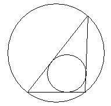

# Area Ratio [⬀](https://www.e-olymp.com/en/problems/1115)

To make things easier, WishingBone decides to put this simple geometry problem at the beginning. Given a triangle, what is the ratio of the area of its inscribed circle to that of its circum circle?



## Input

9 integers x1, y1, z1, x2, y2, z2, x3, y3, z3 (-1000 ≤ xi, yi, zi ≤ 1000) are given on each line, the coordinates of triangle vertices. No three points are collinear.

## Output

For each test case print the ratio on a separate line with three decimal digits. If rounding to a given accuracy you get zero, print the message "Zero!" (without the quotes).

_Time limit 1 second_

_Memory limit 122.17 MiB_

## Input example #1
```
0 0 0 0 0 1 0 1 0
```

## Output example #1
```
0.172
```
