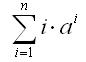

# Very Easy!!! [⬀](https://www.e-olymp.com/en/problems/1210)
You are given the value of n and a. Determine the answer for the following series:



## Input
Two positive integers n and a.

## Output
Print the value of sum. It is known that the result is no more than 1018.

## Input example #1
```
3 3
```

## Output example #1
```
102
```

## Input example #2
```
4 4
```

## Output example #2
```
1252
```
