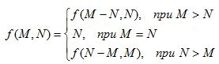

# Function 9 [⬀](https://www.e-olymp.com/en/problems/2214)

Given the function which arguments are positive integers



Write a program to evaluate this function.

## Input

Two integers n and m (1 ≤ n, m ≤ 10¹⁸).

## Output

Print the result of the function.

*Time limit 1 seconds*

*Memory limit 16 MiB*


## Input example #1

```
6 3
```

## Output example #1

```
3
```

## Input example #2

```
12 12
```

## Output example #2

```
12
```


