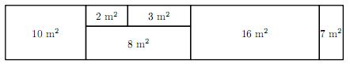

# [Flat](https://www.e-olymp.com/en/problems/2375)
You are one of the developers of software for a real estate agency. One of the functions you are to implement is calculating different kinds of statistics for flats the agency is selling. Each flat consists of different types of rooms: bedroom, bathroom, kitchen, balcony and others.

The cost of the flat is equal to the product of reduced total area and the cost of one square meter. Reduced total area is the total area of all rooms except for balconies plus one half of balconies total area.

You will be given some information about the area of each room in the flat and the cost of one square meter. You are to calculate the following values for the flat:

- the total area of all rooms;
- the total area of all bedrooms;
- the cost of the flat.

## Input
The first line contains two integer numbers n (1 ≤ n ≤ 10) and c (1 ≤ c ≤ 100000) - number of rooms in the flat and the cost of one square meter, respectively.

Each of the following n lines contains an integer number aᵢ (1 ≤ aᵢ ≤ 100) and a word tᵢ - the area of i-th room and its type, respectively. Word ti is one of the following: "bedroom", "bathroom", "kitchen", "balcony", "other".

## Output
The first line should contain one integer number - the total area of all rooms of the flat. The second line should contain one integer number - the total area of bedrooms of the flat. The third line should contain one real number - the cost of the flat with precision not worse than 10^-6.

The figure shows the flat from the first example.



## Input example #1
```
6 75000
8 other
3 bathroom
2 bathroom
10 kitchen
16 bedroom
7 balcony
```

## Output example #1
```
46
16
3187500.0
```

## Input example #2
```
2 75123
10 kitchen
15 balcony
```

## Output example #2
```
25
0
1314652.5
```
