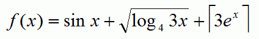

# [Function](https://www.e-olymp.com/en/problems/4812)
Let function f(x) is defined as



Calculate the value of f(x) for a given x.

## Input
Each line contains one double value x (x ≥ 1).

## Output
For each value x print on a separate line the value f(x) with 6 digits after the decimal point.

## Input example #1
```
1
2.3
2.56
7.123456
```

## Output example #1
```
10.731685
31.926086
40.762019
3725.231017
```
