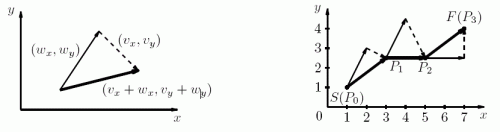

# [Joy of Flight](https://www.e-olymp.com/en/problems/7501)
Jacob likes to play with his radio-controlled aircraft. The weather today is pretty windy and Jacob has to plan flight carefully. He has a weather forecast - the speed and direction of the wind for every second of the planned flight.

The plane may have airspeed up to vmax units per second in any direction. The wind blows away plane in the following way: if airspeed speed of the plane is (vx, vy) and the wind speed is (wx, wy), the plane moves by (vx + wx, vw + wy) each second.



Jacob has a fuel for exactly k seconds, and he wants to learn, whether the plane is able to fly from start to finish in this time. If it is possible he needs to know the flight plan: the position of the plane after every second of flight.

## Input
The first line contains four integers Sx, Sy, Fx, Fy (-10000 ≤ Sx, Sy, Fx, Fy ≤ 10000) - coordinates of start and finish.

The second line contains three integers n, k and vmax - the number of wind condition changes, duration of Jacob's flight in seconds and maximum aircraft speed (1 ≤ n, k, vmax ≤ 10000).

The following n lines contain the wind conditions description. The i-th of these lines contains integers ti, wxi and wyi - starting at time ti the wind will blow by vector (w[xi], w[yi]) each second (0 = t1 < ... < ti < ti+1 < ... < k, sqrt(w[xi]^2 + w[yi]^2) ≤ vmax).

## Output
The first line must contain "Yes" if Jacob's plane is able to fly from start to finish in k seconds, and "No" otherwise.

If it can to do that, the following k lines must contain the flight plan. The i-th of these lines must contain two floating point numbers x and y - the coordinates of the position (Pi) of the plane after i-th second of the flight.

The plan is correct if for every i (1 ≤ i ≤ k) it is possible to fly in one second from Pi-1 to some point Qi, such that distance between Qi and Pi doesn't exceed 10^-5, where P0 = S. Moreover the distance between Pk and F should not exceed 10^-5 as well.

## Input example #1
```
1 1 7 4
2 3 10
0 1 2
2 2 0
```

## Output example #1
```
Yes
3 2.5
5 2.5
7 4
```
