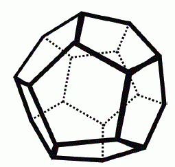

# [Polyhedra](https://www.e-olymp.com/en/problems/8172)



Given a sphere, you can slice through the surface of the sphere to make different convex polyhedra. All of these convex polyhedra have the Euler characteristic which can be defined as follows:

```
x = V - E + F = 2
```

where `V` represents the number of vertices, `E` the number of edges and `F` the number of faces on a convex polyhedron.

## Input

Begins with the number of test cases `t` (1 ≤ t ≤ 100). Each test case consists of a single line with two space-separated integers `V` and `E` (`4 ≤ V, E ≤ 100`), representing the number of vertices and edges respectively of the convex polyhedron.

## Output

For each test case, print on a single line the number of faces in the defined polyhedron.

_Time limit 1 second_

_Memory limit 128 MiB_

## Input example #1
```
2
8 12
4 6
```

## Output example #1
```
6
4
```
