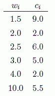

# [Diamonds](https://www.e-olymp.com/en/contests/9290/problems/80893)

A diamond's overall worth is determined by its mass in carats as well as its overall clarity. A large diamond with many imperfections is not worth as much as a smaller, flawless diamond. The overall clarity of a diamond can be described on a scale from 0.0 - 10.0 adopted by the American Gem Society, where 0.0 represents a flawless diamond and 10.0 represents an imperfect diamond.

Given a sequence of n diamonds, each with weight, wi, in carats and clarity ci, on the scale described above, find the longest subsequence of diamonds for which the weight and clarity are both becoming strictly more favorable to a buyer.

In the following sequence of diamonds 



the longest desirable subsequence is 


because the weights strictly increase while the clarities strictly decrease.

## Input

Starts with a line with a number of test cases t (1 ≤ t ≤ 100). Each test case begins with a line with a single integer n (1 ≤ n ≤ 200), indicating the number of diamonds. Next follow n lines with 2 real numbers wi and ci, (0.0 ≤ wi, ci ≤ 10.0), indicating the weight in carats and the clarity of diamond i respectively.

## Output

For each test case, print a single line with the length of the longest desirable subsequence of diamonds.

## Input example #1
```
3
2
1.0 1.0
1.5 0.0
3
1.0 1.0
1.0 1.0
1.0 1.0
6
1.5 9.0
2.0 2.0
2.5 6.0
3.0 5.0
4.0 2.0
10.0 5.5
```

## Output example #1
```
2
1
4
```
