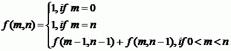

# [Function-10](https://www.e-olymp.com/en/contests/9493/problems/83153)

The function is given with nonnegative integer arguments m and n (m ≤ n):



Find the function value.

## Input
Two nonnegative integers n and m (0 ≤ n, m ≤ 20).

## Output
Print the value of the function f(m, n).

## Input example #1
```
4 2
```

## Output example #1
```
6
```
