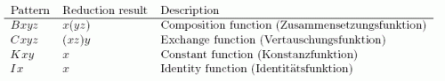
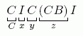
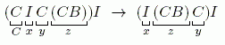
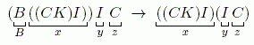
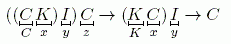
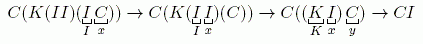
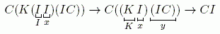

# Combinator Expression [⬀](https://www.e-olymp.com/en/contests/9666/problems/84865)
Combinatory logic may be thought as one of computational models allowing to express any computable function as a composition of functions from a small finite basis. In this problem we consider a restricted variant of BCKW basis, BCKI.

Combinator expression in BCKI basis is a string, corresponding to the following grammar:

⟨Expression⟩ ::= ⟨Expression⟩ ⟨Term⟩ | ⟨Term⟩

⟨Term⟩ ::= ( ⟨Expression⟩ ) | B | C | K | I

As we can see from the grammar, the expression is a tree of applications where leafs are combinators B, C, K and I. The application is left-associative. For example BIC is equivalent to (BI)C, but not to B(IC).

For the sake of the explanation we will use lowercase English letters (a, ..., z) to represent sub-expressions. These lowercase letters will not appear in real data. For example, BIC can be represented by BxC (x = I), x (x = BIC), xy (x = BI, y = C), Bxy (x = I, y = C) but not by Bx.

We say that in expression pq we apply p to q. We can employ our intuition by saying that p is a function and q is its parameter. However, the evaluation process is quite different from traditional computation - instead of passing values over fixed expression tree, we evaluate by altering that tree so that the result is also some combinator expression.

To evaluate an expression, we need to select some sub-expression, corresponding to one of the patterns specified in the table below - that is, there should exist such x (and maybe y and z) that the pattern from the table becomes equal to the sub-expression. Then we need to replace the sub-expression with the reduction result from the table.



After the replacement took place we must repeat the process, until there remains no suitable sub- expressions. This final expression is normal form of the original one.

For example, in expression CIC(CB)I we can make the following letter assignment



and see that CIC(CB)I = (((CI)C)(CB))I = (((Cx)y)z)I contains C combinator pattern and thus reduces to ((xz)y)I = I(CB)CI:



One more example: B((CK)I)IC expression. Let us first reduce combinator B:



Now, let's reduce the last I:


And now we finish evaluation with two more reductions:



It is possible to show that the normal form remains the same irrespectable to the order of evaluation. For example, the following evaluation order:



leads to the same result as



However, as you see, the number of reductions is different: 3 in the first case and 2 in the second. This poses an interesting problem | to find an evaluation order with the minimal number of reductions for a given formula.

Your task is to write a program which finds the minimal number of reductions required for a given combinator expression to be evaluated to its normal form.

## Input
The only line contains a combinator expression corresponding to the grammar above. The length of the expression does not exceed 30 000. The expression contains no whites paces or symbols not specified in the grammar.

## Output
Output a single integer - the minimal number of reductions required for the given formula to evaluate it to normal form.

## Input example #1
```
C(K(II)(IC))
```

## Output example #1
```
2
```

## Input example #2
```
CIBI
```

## Output example #2
```
3
```

## Input example #3
```
BBBBBCCCCCKKKKKIIIII
```

## Output example #3
```
15
```

