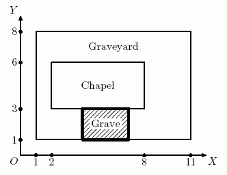

# [Grave](https://www.e-olymp.com/en/contests/9666/problems/84869)
Gerard develops a Halloween computer game. The game is played on a rectangular graveyard with a rectangular chapel in it. During the game, the player places new rectangular graves on the graveyard. The grave should completely fit inside graveyard territory and should not overlap with the chapel. The grave may touch borders of the graveyard or the chapel.



Gerard asked you to write a program that determines whether it is possible to place a new grave of given size or there is no enough space for it.

## Input
The first line contains two pairs of integers: x1, y1, x2, y2 (-10⁹ ≤ x1 < x2 ≤ 10⁹, -10⁹ ≤ y1 < y2 ≤ 10⁹) - coordinates of bottom left and top right corners of the graveyard. The second line also contains two pairs of integers x3, y3, x4, y4 (x1 < x3 < x4 < x2, y1 < y3 < y4 < y2) - coordinates of bottom left and top right corners of the chapel.

The third line contains two integers w, h - width and height of the new grave (1 ≤ w, h ≤ 10⁹). Side with length w should be placed along OX axis, side with length h - along OY axis.

## Output
Print "Yes", if it is possible to place the new grave, or "No", if there is not enough space for it.

## Input example #1
```
1 1 11 8
2 3 8 6
3 2
```

## Output example #1
```
Yes
```

## Input example #2
```
1 1 11 8
2 3 8 6
4 3
```

## Output example #2
```
No
```
