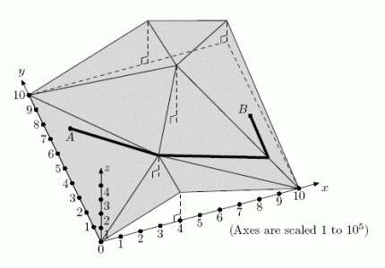

# Hiking in the Hills [⬀](https://www.e-olymp.com/en/contests/9666/problems/84870)
Helen is hiking with her friends in a highland. Their plan is to hike from their camp A to a beautiful showplace B.

Unfortunately, Helen started feeling dizzy due to altitude sickness. Help her group find a route such that the topmost height on that route is as small as possible.



## Input
Contains full information about the landscape of a square region 10⁶ * 10⁶ in the following format. The first line contains integer n - the number of triangles in the landscape (2 ≤ n ≤ 2000). Each of following n lines contains nine integers xᵢ₁, yᵢ₁, zᵢ₁, xᵢ₂, yᵢ₂, zᵢ₂, xᵢ₃, yᵢ₃, zᵢ₃ - coordinates of a triangle. All coordinates belong to the closed interval [0, 10⁶]. The two last lines contain three integers each: xA, yA, zA and xB, yB, zB - coordinates of the camp A and the showplace B.

The given triangles are guaranteed to describe a consistent continuous landscape. Projections of triangles onto XY plane are non-degenerate and fill the square without overlapping. A vertex of one triangle never lays inside an edge of another triangle. Points A and B belong to the landscape surface and are different.

## Output
Output a polyline route from A to B with the smallest possible topmost height. The first line should contain m, the number of vertices in this polyline. Each of following m lines should contain three integer coordinates of a polyline vertex: xᵢ, yᵢ and zᵢ. Vertices must be listed along the polyline, from A to B (including these two endpoints).

All coordinates of polyline vertices should be integer. Each polyline edge must belong to some triangle from the input (possibly, to its edge). The number of vertices in the polyline must not exceed 5n.

## Input example #1
```
8
1000000 0 0 1000000 1000000 150000 600000 600000 400000
0 1000000 0 600000 600000 400000 600000 1000000 300000
0 1000000 0 400000 300000 150000 600000 600000 400000
400000 0 200000 1000000 0 0 400000 300000 150000
400000 300000 150000 1000000 0 0 600000 600000 400000
600000 600000 400000 1000000 1000000 150000 600000 1000000 300000
0 0 0 400000 0 200000 400000 300000 150000
0 1000000 0 0 0 0 400000 300000 150000
100000 700000 37500
900000 400000 137500
```

## Output example #1
```
5
100000 700000 37500
0 1000000 0
400000 300000 150000
1000000 0 0
900000 400000 137500
```
