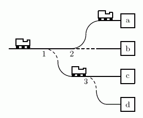
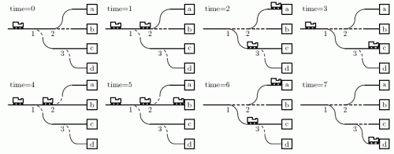

# [Instruction](https://www.e-olymp.com/en/contests/9666/problems/84871)
Ingrid is a head of a big railway station and, among other duties, is responsible for routing trains to the right platforms. The station has one entrance, and there are many switches that direct trains to other switches and platforms.

Each switch has one inbound track and two outbound tracks, platforms have one inbound track, and station entrance has one outbound track. Each outbound track is connected to one inbound track and vice versa. Every switch and platform is reachable from station entrance.

Platforms have a rail dead ends and you may assume that trains disappear from the platform immediately after arriving to it.



Each morning Ingrid looks at the timetable and writes switch toggling instruction: when and which switch to toggle. She would like to automate this process to save a lot of time.

## Input
The first line contains a single integer n (3 ≤ n ≤ 51) - the total number of switches and platforms on the station.

The i-th of the following n lines describes a switch or a platform with an index i. Description starts with a character p for a platform or s for a switch. Next number q[i] indicates the number of the switch the inbound track is connected to or 0 if it is connected to station entrance (0 ≤ q[i] < i). Description of the platform also contains a unique lowercase English letter - the platform identifier.

Trains spend exactly one minute to move between two connected switches or a switch and a platform. In the morning, each switch is toggled in a way that a train would pass to the one of the two outbound tracks connected to the switch/platform with the lower number.

Next line of the input contains a single integer m (1 ≤ m ≤ 1000) - the number of trains in timetable.

Each of the following m lines contains integer ai (0 ≤ a[i] ≤ 10 000, a[i] >a[i-1]) - the time in minutes when a train arrives to the station entrance, and the letter pi - identifier of the destination platform for this train.

## Output
In the first line output integer c - the number of commands in the switch toggling instruction. For each command, output two integers s[i] and t[i] (1 ≤ s[i] ≤ n, 0 ≤ t[i] ≤ 10⁹) - the number of the switch and the time to toggle it. Assume that the switch is toggled between minutes ti - 1 and ti.

Output commands in order of non-decreasing time. The number of commands should not exceed 100 000.

## Sample
Below is the time trace for the first example.



## Input example #1
```
7
s 0
s 1
s 1
p 2 a
p 2 b
p 3 c
p 3 d
5
0 a
1 c
3 b
4 a
5 d
```

## Output example #1
```
6
1 2
1 4
2 5
2 6
1 6
3 7
```

## Input example #2
```
5
s 0
p 1 y
s 1
p 3 z
p 3 x
3
7 y
8 y
15 y
```

## Output example #2
```
0
```

## Input example #3
```
3
s 0
p 1 y
p 1 z
3
7 y
8 y
10 y
```

## Output example #3
```
5
1 1
1 2
1 2
1 3
1 200
```