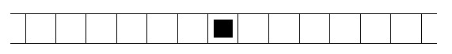

# [Robot](https://www.e-olymp.com/en/problems/87)



The infinite in both directions stripe with width 1 is divided into blocks of size 1 x 1. In one of these blocks the robot is located. It can move from one cell to another (the robot at the figure is marked with square). Its movements are determined by the program, each instruction is given by one of three capital letters: L, R, S. The instruction L says the robot to move one cell to the left, the instruction R - to move one square right, and S - to stay in the same cell. Program execution means the sequential execution of all instruction in it.

Write a program that will determine how many different cells visits the robot.

## Input
The program for the robot is a string of characters L, R, S. The program consists of no more than 10,000 instruction.

## Output
Print the number of different cells that visits the robot performing the program.

## Input example #1
```
RRSRRLRR
```

## Output example #1
```
6
```
