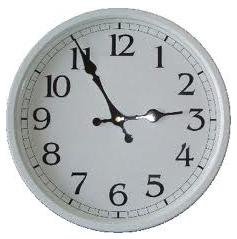

# The Angle [⬀](https://www.e-olymp.com/en/problems/1125)



The angle between the hour and the minute hand is always among 0 and 180 degrees (including 0 and 180). For example, the angle between two hands of a clock at 12:00 is 0 while at 6:00 the angle is 180 degrees. Find the angle between the hands of a clock at some given time (from 12:00 till 11:59).

## Input
Each line represents a separate test case and consists of two numbers: the first number stands for the hour (from 0 till 12) and the second stands for the minute (from 0 till 59). The input ends when two numbers are both zero.

## Output
For each test case print in a separate line the minimum angle between the two hands in format given in the output.

## Input example #1
```
12 0
12 30
6 0
3 0
0 0
```

## Output example #1
```
At 12:00 the angle is 0.0 degrees.
At 12:30 the angle is 165.0 degrees.
At 6:00 the angle is 180.0 degrees.
At 3:00 the angle is 90.0 degrees.
```
