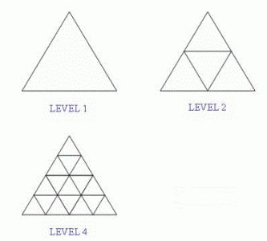

# Counting Triangles [⬀](https://www.e-olymp.com/en/problems/4556)
We define the LEVEL of a triangle as in the following illustrative image:



You have to count all triangles in the biggest one (level n).

## Input
The first line contains the number of test cases t (t ≤ 10000). Each line contains an integer n (1 ≤ n ≤ 10⁶) which is the level of the triangle in that test case.

## Output
For each test case, you should write a separate line: the number of triangles in the biggest one (level n). All answers will fit within the range of a 64-bit integer.

## Input example #1
```
3
1
2
3
```

## Output example #1
```
1
5
13
```
