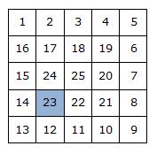

# [Spiral](https://www.e-olymp.com/en/problems/85)



Numbers from 1 to n² are written in a square matrix of size n × n in a spiral starting from the top left cell in a clockwise direction, as shown in the figure. Find a number which is located in the i-th row and j-th column.

## Input
Three natural numbers n, i, j (1 ≤ i, j ≤ n ≤ 100).

## Output
Print the number that has the coordinates i, j.

## Input example #1
```
5 4 2
```

## Output example #1
```
23
```
