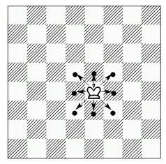

# [Lonely king](https://www.e-olymp.com/en/problems/4557)



The lonely king wandered through the infinite chessboard. It is known the sequence of its n moves (up, down, left, right, up-left, etc.) the possible moves of the king are shown below.

Create an algorithm that determines whether the king has visited twice the same field in his n moves.


## Input
First line contains the number of king's moves `n` (0 ≤ n ≤ 1000). Next n lines give the directions of king's moves: line number `i + 1` gives the king's direction at the i-th move.

## Output
Print a single number - the number of the move when the King first come to some cell for the second time. If such event will not happen, print "Ok" message in the first line (without quotes), and in the second line print the Manhattan distance between the starting and ending points of king's travel path.

Manhattan distance is a distance between the points with coordinates `(x1, y1)` and `(x2, y2)` that evaluates by the formula: `d = |x2 - x1| + |y2 - y1|`.

## Input example #1
```
5
1
2
4
7
4
```

## Output example #1
```
4
```

## Input example #2
```
5
1
2
4
6
4
```

## Output example #2
```
Ok
2
```
