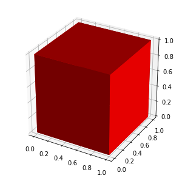
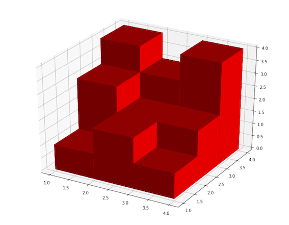

# 3D Surface Area [⬀](https://www.hackerrank.com/challenges/3d-surface-area)


Madison is a little girl who is fond of toys. Her friend Mason works in a toy manufacturing factory. Mason has a 2D board `A` of size `H × W` with `H` rows and `W` columns. The board is divided into cells of size `1 × 1` with each cell indicated by its coordinate `(i, j)`. The cell `(i, j)` has an integer `Aᵢⱼ` written on it. To create the toy Mason stacks `Aᵢⱼ` number of cubes of size `1 × 1 × 1` on the cell `(i, j)`.

Given the description of the board showing the values of `Aᵢⱼ` and that the price of the toy is equal to the 3d surface area find the price of the toy.

## Input Format

The first line contains two space-separated integers `H` and `W` the height and the width of the board respectively.

The next `H` lines contains `W` space separated integers. The `jᵗʰ` integer in `iᵗʰ` line denotes `Aᵢⱼ`.

## Constraints
- `1 ≤ H, W ≤ 100`
- `1 ≤ Aᵢⱼ ≤ 100`

## Output Format

Print the required answer, i.e the price of the toy, in one line.

## Sample Input 0
```
1 1
1
```

## Sample Output 0
```
6
```

## Explanation 0



The surface area of `1 × 1 × 1` cube is `6`.

## Sample Input 1
```
3 3
1 3 4
2 2 3
1 2 4
```

## Sample Output 1
```
60
```

## Explanation 1



The object is rotated so the front row matches column 1 of the input, heights 1, 2, and 1.

- The front face is 1 + 2 + 1 = 4 units in area.
- The top is 3 units.
- The sides are 4 units.
- None of the rear faces are exposed.
- The underside is 3 units.
- The front row contributes 4 + 3 + 4 + 3 = 14 units to the surface area.
