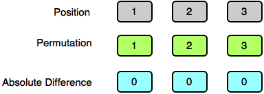

# Absolute Permutation [⬀](https://www.hackerrank.com/challenges/absolute-permutation)

We define `P` to be a permutation of the first `n` natural numbers in the range `[1, n]`. Let `pos[i]` denote the value at position `i` in permutation `P` using `1`-based indexing.

`P` is considered to be an absolute permutation if `|pos[i] - i| = k` holds true for every `i ∈ [1, n]`.

Given `n` and `k`, print the lexicographically smallest absolute permutation `P`. If no absolute permutation exists, print `-1`.

## Example
- `n = 4`
- `k = 2`

Create an array of elements from `1` to `n`, `pos = [1, 2, 3, 4]`. Using `1` based indexing, create a permutation where every `|pos[i] - i| = k`. It can be rearranged to `[3, 4, 1, 2]` so that all of the absolute differences equal `k = 2`:

```
pos[i]  i   |pos[i] - i|
  3     1        2
  4     2        2
  1     3        2
  2     4        2
```

## Function Description

Complete the `absolutePermutation` function in the editor below.

`absolutePermutation` has the following parameter(s):

- `int n`: the upper bound of natural numbers to consider, inclusive
- `int k`: the absolute difference between each element's value and its index

## Returns

- `int[n]`: the lexicographically smallest permutation, or `[-1]` if there is none

## Input Format

- The first line contains an integer `t`, the number of queries.
- Each of the next `t` lines contains `2` space-separated integers, `n` and `k`.

## Constraints

- `1 ≤ t < 10`
- `1 ≤ n ≤ 10⁵`
- `0 ≤ k < n`

## Sample Input
```
STDIN   Function
-----   --------
3       t = 3 (number of queries)
2 1     n = 2, k = 1
3 0     n = 3, k = 0
3 2     n = 3, k = 2
```

## Sample Output
```
2 1
1 2 3
-1
```

## Explanation

### Test Case 0:


### Test Case 1:



### Test Case 2:

No absolute permutation exists, so we print `-1` on a new line.
