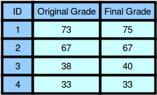

# Grading Students [⬀](https://www.hackerrank.com/challenges/grading)

HackerLand University has the following grading policy:

- Every student receives a `grade` in the inclusive range from `0` to `100`.
- Any `grade` less than `40` is a failing grade.

Sam is a professor at the university and likes to round each student's `grade` according to these rules:

- If the difference between the `grade` and the next multiple of `5` is less than `3`, round `grade` up to the next multiple of `5`.
- If the value of `grade` is less than `38`, no rounding occurs as the result will still be a failing grade.

## Examples

- `grade = 84` round to  (`85 - 84` is less than `3`)
- `grade = 29` do not round (result is less than `40`)
- `grade = 57` do not round (`60 - 57` is `3` or higher)

Given the initial value of `grade` for each of Sam's `n` students, write code to automate the rounding process.

## Function Description

Complete the function `gradingStudents` in the editor below.

`gradingStudents` has the following parameter(s):

- `int grades[n]`: the grades before rounding

## Returns

- `int[n]`: the grades after rounding as appropriate

## Input Format

The first line contains a single integer, `n`, the number of students.

Each line `i` of the `n` subsequent lines contains a single integer, `grades[i]`.

## Constraints
- `1 ≤ n ≤ 60`
- `0 ≤ grades[i] ≤ 100`

## Sample Input 0
```
4
73
67
38
33
```

## Sample Output 0
```
75
67
40
33
```

## Explanation 0



1. Student `1` received a `73`, and the next multiple of `5` from `73` is `75`. Since `75 - 73 < 3`, the student's grade is rounded to `75`.
2. Student `2` received a `67`, and the next multiple of `5` from `67` is `70`. Since `70 - 67 = 3`, the grade will not be modified and the student's final grade is `67`.
3. Student `3` received a `38`, and the next multiple of `5` from `38` is `40`. Since `40 - 38 < 3`, the student's grade will be rounded to `40`.
4. Student `4` received a grade below `33`, so the grade will not be modified and the student's final grade is `33`.
