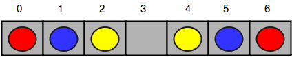
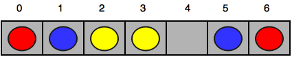
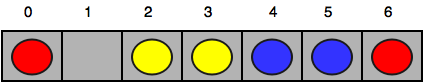
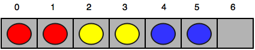

# Happy Ladybugs [⬀](https://www.hackerrank.com/challenges/happy-ladybugs)

Happy Ladybugs is a board game having the following properties:

- The board is represented by a string, `b`, of length `n`. The `iᵗʰ` character of the string, `b[i]`, denotes the `iᵗʰ` cell of the board.
- - If `b[i]` is an underscore (i.e., `_`), it means the `iᵗʰ` cell of the board is empty.
- - If `b[i]` is an uppercase English alphabetic letter (ascii[A-Z]), it means the `iᵗʰ` cell contains a ladybug of color `b[i]`.
- - String `b` will not contain any other characters.
- A ladybug is happy only when its left or right adjacent cell (i.e., `b[i ± 1]`) is occupied by another ladybug having the same color.
- In a single move, you can move a ladybug from its current position to any empty cell.

Given the values of `n` and `b` for  games of Happy Ladybugs, determine if it's possible to make all the ladybugs happy. For each game, return `YES` if all the ladybugs can be made happy through some number of moves. Otherwise, return `NO`.

## Example
```
b = [YYR_B_BR]
```

You can move the rightmost `B` and `R` to make `b = [YYRRBB__]` and all the ladybugs are happy. Return `YES`.

## Function Description

Complete the happyLadybugs function in the editor below.

`happyLadybugs` has the following parameters:

- `string b`: the initial positions and colors of the ladybugs

## Returns

- `string`: either `YES` or `NO`

## Input Format

The first line contains an integer `g`, the number of games.

The next `g` pairs of lines are in the following format:

- The first line contains an integer `n`, the number of cells on the board.
- The second line contains a string `b` that describes the  cells of the board.

## Constraints
- `1 ≤ g, n ≤ 100`
- `b[i] ∈ {_, ascii[A-Z]}`

## Sample Input 0
```
4
7
RBY_YBR
6
X_Y__X
2
__
6
B_RRBR
```

## Sample Output 0
```
YES
NO
YES
YES
```

## Explanation 0

The four games of Happy Ladybugs are explained below:

1. Initial board:



After the first move:



After the second move:



After the third move:



Now all the ladybugs are happy, so we print `YES` on a new line.

2. There is no way to make the ladybug having color Y happy, so we print `NO` on a new line.

3. There are no unhappy ladybugs, so we print `YES` on a new line.

4. Move the rightmost `B` and `R` to form `b = [BBRRR_]`.

## Sample Input 1
```
5
5
AABBC
7
AABBC_C
1
_
10
DD__FQ_QQF
6
AABCBC
```

## Sample Output 1
```
NO
YES
YES
YES
NO
```
