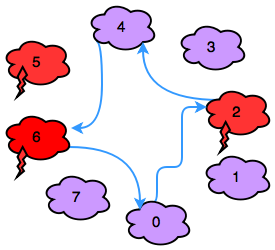

# Jumping on the Clouds: Revisited [⬀](https://www.hackerrank.com/challenges/jumping-on-the-clouds-revisited)

A child is playing a cloud hopping game. In this game, there are sequentially numbered clouds that can be thunderheads or cumulus clouds. The character must jump from cloud to cloud until it reaches the start again.

There is an array of clouds, `c` and an energy level `e = 100`. The character starts from `c[0]` and uses `1` unit of energy to make a jump of size `k` to cloud `c[(i + k) % n]`. If it lands on a thundercloud, `c[i] = 1`, its energy (`e`) decreases by `2` additional units. The game ends when the character lands back on cloud `0`.

Given the values of `n`, `k`, and the configuration of the clouds as an array `c`, determine the final value of `e` after the game ends.

## Example. 
```
c = [0, 0, 1, 0]
k = 2
```

The indices of the path are `0 → 2 → 0`. The energy level reduces by `1` for each jump to `98`. The character landed on one thunderhead at an additional cost of `2` energy units. The final energy level is `96`.

**Note:** Recall that `%` refers to the modulo operation. In this case, it serves to make the route circular. If the character is at `c[n-1]` and jumps `1`, it will arrive at `c[0]`.

## Function Description

Complete the `jumpingOnClouds` function in the editor below.

`jumpingOnClouds` has the following parameter(s):

- `int c[n]`: the cloud types along the path
- `int k`: the length of one jump

## Returns

- `int`: the energy level remaining.

## Input Format

The first line contains two space-separated integers, `n` and `k`, the number of clouds and the jump distance.

The second line contains `n` space-separated integers `c[i]` where `0 ≤ i < n`. Each cloud is described as follows:

- If `c[i] = 0`, then cloud `i` is a cumulus cloud.
- If `c[i] = 1`, then cloud `i` is a thunderhead.

## Constraints

- `2 ≤ n ≤ 25`
- `1 ≤ k ≤ n`
- `n % k = 0`
- `c[i] ∈ {0, 1}`

## Sample Input
```
STDIN             Function
-----             --------
8 2               n = 8, k = 2
0 0 1 0 0 1 1 0   c = [0, 0, 1, 0, 0, 1, 1, 0]
```

## Sample Output
```
92
```

## Explanation

In the diagram below, red clouds are thunderheads and purple clouds are cumulus clouds:



Observe that our thunderheads are the clouds numbered `2`, `5`, and `6`. The character makes the following sequence of moves:

1. Move: `0 → 2`, Energy: `e = 100 - 1 - 2 = 97`.
2. Move: `2 → 4`, Energy: `e = 97 - 1 = 96`.
3. Move: `4 → 6`, Energy: `e = 96 - 1 - 2 = 93`.
4. Move: `6 → 0`, Energy: `e = 93 - 1 = 92`.
