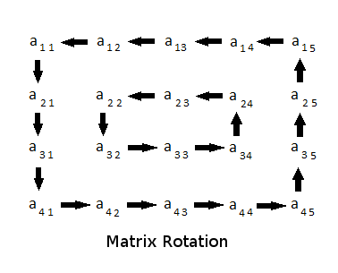

# Matrix Layer Rotation [⬀](https://www.hackerrank.com/challenges/matrix-rotation-algo)

You are given a 2D matrix of dimension `m × n` and a positive integer `r`. You have to rotate the matrix `r` times and print the resultant matrix. Rotation should be in anti-clockwise direction.

Rotation of a `4 × 5` matrix is represented by the following figure. Note that in one rotation, you have to shift elements by one step only.



It is guaranteed that the minimum of `m` and `n` will be even.

As an example rotate the Start matrix by 2:

```
    Start         First           Second
     1 2 3 4       2  3  4  5      3  4  5  6
    12 1 2 5  ->   1  2  3  6 ->   2  3  4  7
    11 4 3 6      12  1  4  7      1  2  1  8
    10 9 8 7      11 10  9  8     12 11 10  9
```

## Function Description

Complete the matrixRotation function in the editor below.

matrixRotation has the following parameter(s):

- `int matrix[m][n]`: a 2D array of integers
- `int r`: the rotation factor

## Prints

It should print the resultant 2D integer array and return nothing. Print each row on a separate line as space-separated integers.

## Input Format

The first line contains three space separated integers, `m`, `n`, and `r`, the number of rows and columns in `matrix`, and the required rotation.

The next `m` lines contain `n` space-separated integers representing the elements of a row of `matrix`.

## Constraints

- `2 ≤ m, n ≤ 300`
- `1 ≤ r ≤ 10⁹`
- `min(m, n) % 2 = 0`
- `1 ≤ matrix[i][j] ≤ 10⁸` where `i ∈ [1..m]` and `j ∈ [1..n]`

## Sample Input

### Sample Input #01

```
STDIN        Function
-----        --------
4 4 2        rows m = 4, columns n = 4, rotation factor r = 2
1 2 3 4      matrix = [[1, 2, 3, 4], [5, 6, 7, 8], [9, 10, 11, 12], [13, 14, 15, 16]]
5 6 7 8
9 10 11 12
13 14 15 16
```

### Sample Output #01
```
3 4 8 12
2 11 10 16
1 7 6 15
5 9 13 14
```

### Explanation #01

The matrix is rotated through two rotations.
```
     1  2  3  4      2  3  4  8      3  4  8 12
     5  6  7  8      1  7 11 12      2 11 10 16
     9 10 11 12  ->  5  6 10 16  ->  1  7  6 15
    13 14 15 16      9 13 14 15      5  9 13 14
```

### Sample Input #02
```
5 4 7
1 2 3 4
7 8 9 10
13 14 15 16
19 20 21 22
25 26 27 28
```

### Sample Output #02
```
28 27 26 25
22 9 15 19
16 8 21 13
10 14 20 7
4 3 2 1
```

### Explanation 02

The various states through 7 rotations:
```
    1  2  3  4      2  3  4 10    3  4 10 16    4 10 16 22
    7  8  9 10      1  9 15 16    2 15 21 22    3 21 20 28
    13 14 15 16 ->  7  8 21 22 -> 1  9 20 28 -> 2 15 14 27 ->
    19 20 21 22    13 14 20 28    7  8 14 27    1  9  8 26
    25 26 27 28    19 25 26 27    13 19 25 26   7 13 19 25

    10 16 22 28    16 22 28 27    22 28 27 26    28 27 26 25
     4 20 14 27    10 14  8 26    16  8  9 25    22  9 15 19
     3 21  8 26 ->  4 20  9 25 -> 10 14 15 19 -> 16  8 21 13
     2 15  9 25     3 21 15 19     4 20 21 13    10 14 20  7
     1  7 13 19     2  1  7 13     3  2  1  7     4  3  2  1
```

### Sample Input #03
```
2 2 3
1 1
1 1
```

### Sample Output #03
```
1 1
1 1
```

### Explanation #03

All of the elements are the same, so any rotation will repeat the same matrix.
