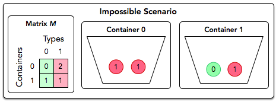

# Organizing Containers of Balls [⬀](https://www.hackerrank.com/challenges/organizing-containers-of-balls)

David has several containers, each with a number of balls in it. He has just enough containers to sort each type of ball he has into its own container. David wants to sort the balls using his sort method.

David wants to perform some number of swap operations such that:

- Each container contains only balls of the same type.
- No two balls of the same type are located in different containers.

## Example

`container = [[1, 4], [2, 3]]`

David has `n = 2` containers and `2` different types of balls, both of which are numbered from `0` to `n - 1 = 1`. The distribution of ball types per container are shown in the following diagram.


In a single operation, David can swap two balls located in different containers.

The diagram below depicts a single swap operation:


In this case, there is no way to have all green balls in one container and all red in the other using only swap operations. Return `Impossible`.

You must perform `q` queries where each query is in the form of a matrix, `M`. For each query, print `Possible` on a new line if David can satisfy the conditions above for the given matrix. Otherwise, print `Impossible`.

## Function Description

Complete the `organizingContainers` function in the editor below.

`organizingContainers` has the following parameter(s):

- `int containter[n][m]`: a two dimensional array of integers that represent the number of balls of each color in each container

## Returns

`string`: either `Possible` or `Impossible`

## Input Format

The first line contains an integer `q`, the number of queries.

Each of the next `q` sets of lines is as follows:

1. The first line contains an integer `n`, the number of containers (rows) and ball types (columns).
2. Each of the next `n` lines contains `n` space-separated integers describing row `containers[i]`.

## Constraints
- `1 ≤ q ≤ 10`
- `1 ≤ n ≤ 100`
- `0 ≤ containers[i]j[] ≤ 10⁹`

## Scoring

- For 33% of score, `1 ≤ n ≤ 10`.
- For 100% of score, `1 ≤ n ≤ 100`.

## Output Format

For each query, print `Possible` on a new line if David can satisfy the conditions above for the given matrix. Otherwise, print `Impossible`.

## Sample Input 0
```
2
2
1 1
1 1
2
0 2
1 1
```

## Sample Output 0
```
Possible
Impossible
```

## Explanation 0

We perform the following `q = 2` queries:

1. The diagram below depicts one possible way to satisfy David's requirements for the first query:


Thus, we print `Possible` on a new line.

2. The diagram below depicts the matrix for the second query: 




No matter how many times we swap balls of type `t₀` and `t₁` between the two containers, we'll never end up with one container only containing type `t₀` and the other container only containing type `t₁`. Thus, we print `Impossible` on a new line.

## Sample Input 1
```
2
3
1 3 1
2 1 2
3 3 3
3
0 2 1
1 1 1
2 0 0
```

## Sample Output 1
```
Impossible
Possible
```
