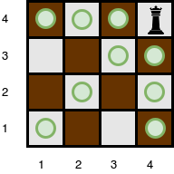

# Queen's Attack II [⬀](https://www.hackerrank.com/challenges/queens-attack-2)

You will be given a square chess board with one queen and a number of obstacles placed on it. Determine how many squares the queen can attack.

A queen is standing on an `n × n` chessboard. The chess board's rows are numbered from `1` to `n`, going from bottom to top. Its columns are numbered from `1` to `n`, going from left to right. Each square is referenced by a tuple, `(r, c)`, describing the row, `r`, and column, `c`, where the square is located.

The queen is standing at position <code>(r<sub>q</sub>, c<sub>q</sub>)</code>. In a single move, she can attack any square in any of the eight directions (left, right, up, down, and the four diagonals). In the diagram below, the green circles denote all the cells the queen can attack from `(4, 4)`:


There are obstacles on the chessboard, each preventing the queen from attacking any square beyond it on that path. For example, an obstacle at location `(3, 5)` in the diagram above prevents the queen from attacking cells `(3, 5)`, `(2, 6)`, and `(1, 7)`:


Given the queen's position and the locations of all the obstacles, find and print the number of squares the queen can attack from her position at <code>(r<sub>q</sub>, c<sub>q</sub>)</code>. In the board above, there are 24 such squares.

## Function Description

Complete the `queensAttack` function in the editor below.

`queensAttack` has the following parameters:
- `int n`: the number of rows and columns in the board
- `int k`: the number of obstacles on the board
- `int r_q`: the row number of the queen's position
- `int c_q`: the column number of the queen's position
- `int obstacles[k][2]`: each element is an array of 2 integers, the row and column of an obstacle

## Returns
- `int`: the number of squares the queen can attack

## Input Format

- The first line contains two space-separated integers `n` and `k`, the length of the board's sides and the number of obstacles.
- The next line contains two space-separated integers <code>r<sub>q</sub></code> and <code>c<sub>q</sub></code>, the queen's row and column position.
- Each of the next `k` lines contains two space-separated integers `r[i]` and `c[i]`, the row and column position of `obstacle[i]`.

## Constraints

- `0 < n ≤ 10⁵`
- `0 ≤ k ≤ 10⁵`
- A single cell may contain more than one obstacle.
- There will never be an obstacle at the position where the queen is located.

## Subtasks

For 30% of the maximum score:
- `0 < n ≤ 100`
- `0 ≤ k ≤ 100`

For 55% of the maximum score:
- `0 < n ≤ 1000`
- `0 ≤ k ≤ 10⁵`


## Sample Input 0
```
4 0
4 4
```

## Sample Output 0
```
9
```

Explanation 0

The queen is standing at position `(4, 4)` on a `4 × 4` chessboard with no obstacles:



## Sample Input 1
```
5 3
4 3
5 5
4 2
2 3
```

## Sample Output 1
```
10
```

## Explanation 1

The queen is standing at position `(4, 3)` on a `5 × 5` chessboard with `k = 3` obstacles:


The number of squares she can attack from that position is `10`.

## Sample Input 2
```
1 0
1 1
```

## Sample Output 2
```
0
```

## Explanation 2

Since there is only one square, and the queen is on it, the queen can move 0 squares.
