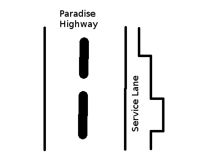

# Service Lane [⬀](https://www.hackerrank.com/challenges/service-lane)

A driver is driving on the freeway. The check engine
light of his vehicle is on, and the driver wants to
get service immediately. Luckily, a service lane runs
parallel to the highway. It varies in width along its
length.



You will be given an array of widths at points along
the road (indices), then a list of the indices of
entry and exit points. Considering each entry and exit
point pair, calculate the maximum size vehicle that
can travel that segment of the service lane safely.

## Example
```
n = 4
width = [2, 3, 2, 1]
cases = [[1, 2], [2, 4]]
```

If the entry index, `i=1` and the exit, `j=2`, there
 are two segment widths of `2` and `3` respectively. The widest vehicle that can fit through both is `2`. If `i=2` and `j=4`, the widths are `[3, 2, 1]` which limits vehicle width to `1`.

## Function Description

Complete the `serviceLane` function in the editor below.

`serviceLane` has the following parameter(s):
- `int n`: the size of the `width` array
- `int cases[t][2]`: each element contains the starting and ending indices for a segment to consider, inclusive

## Returns

- `int[t]`: the maximum width vehicle that can pass through each segment of the service lane described

## Input Format

The first line of input contains two integers, `n` and
`t`, where `n` denotes the number of width
measurements and `t`, the number of test cases. The
next line has `n` space-separated integers which represent the array `width`.

The next `t` lines contain two integers, `i` and `j`,
where `i` is the start index and `j` is the end index of the segment to check.

## Constraints
- `2 ≤ n ≤ 100000`
- `1 ≤ t ≤ 1000`
- `0 ≤ i < j < n`
- `2 ≤ j - i + 1 ≤ min(n, 1000)`
- `1 ≤ width[k] ≤ 3`, where `0 ≤ k < n`


## Sample Input
```
STDIN               Function
-----               --------
8 5                 n = 8, t = 5
2 3 1 2 3 2 3 3     width = [2, 3, 1, 2, 3, 2, 3, 3]
0 3                 cases = [[0, 3], [4, 6], [6, 7], [3, 5], [0, 7]]
4 6
6 7
3 5
0 7
```

## Sample Output
```
1
2
3
2
1
```

## Explanation

Below is the representation of the lane:
```
   |HIGHWAY|Lane|    ->    Width

0: |       |--|            2
1: |       |---|           3
2: |       |-|             1
3: |       |--|            2
4: |       |---|           3
5: |       |--|            2
6: |       |---|           3
7: |       |---|           3
```

1. `(0,3)`: From index `0` through `3` we have widths 
`2`, `3`, `1` and `2`. Nothing wider than `1` can pass all segments.
2. `(4, 6)`: From index `4` through `6` we have widht
`3`, `2`  and `3`. Nothing wider than `2` can pass all segments.
3. `(6, 7)`: `3`,`3` → `3`.
4. `(3, 5)`: `2`, `3`, `2` → `2`
5. `(0, 7)`: `2`, `3`, `1`, `2`, `3`, `2`, `3`, `3` → `1`.
