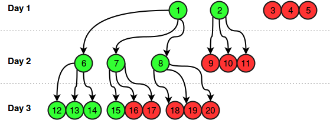

# Viral Advertising [⬀](https://www.hackerrank.com/challenges/sock-merchant)

HackerLand Enterprise is adopting a new viral advertising strategy. When they launch a new product, they advertise it to exactly `5` people on social media.

On the first day, half of those `5` people (i.e., `floor(5/2) = 2`) like the advertisement and each shares it with `3` of their friends. At the beginning of the second day, `floor(5/2) × 3 = 2 × 3 = 6` people receive the advertisement.

Each day, `floor(recipients)` of the recipients like the advertisement and will share it with `3` friends on the following day. Assuming nobody receives the advertisement twice, determine how many people have liked the ad by the end of a given day, beginning with launch day as day 1.

##vExample
```
n = 5
```

```
Day Shared Liked Cumulative
1      5     2       2
2      6     3       5
3      9     4       9
4     12     6      15
5     18     9      24
```

The progression is shown above. The cumulative number of likes on the `5ᵗʰ` day is `24`.

##vFunction Description

Complete the `viralAdvertising` function in the editor below.

`viralAdvertising` has the following parameter(s):

- `int n`: the day number to report

## Returns

int: the cumulative likes at that day

## Input Format

A single integer, `n`, the day number.

## Constraints

- `1 ≤ n ≤ 50`

## Sample Input
```
3
```

## Sample Output
```
9
```

## Explanation

This example is depicted in the following diagram:



`2` people liked the advertisement on the first day, `3` people liked the advertisement on the second day and `4` people liked the advertisement on the third day, so the answer is `2 + 3 + 4 = 9`.
