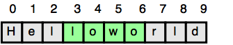

# Java Substring [⬀](https://www.hackerrank.com/challenges/java-substring)

Given a string, `s`, and two indices, `start` and `end`, print a 
[substring](https://en.wikipedia.org/wiki/Substring) consisting of all 
characters in the inclusive range from `start` to `end - 1`. You'll find the 
String class' [substring method](https://docs.oracle.com/javase/8/docs/api/java/lang/String.html#substring-int-int-) 
helpful in completing this challenge.

## Input Format

- The first line contains a single string denoting `s`.
- The second line contains two space-separated integers denoting the respective 
values of `start` and `end`.

## Constraints
- `1 ≤ |s| ≤ 100`
- `0 ≤ start < end ≤ n`
- String `s` consists of English alphabetic letters (i.e., `[a-zA-Z]`) only.

## Output Format

Print the substring in the inclusive range from `start` to `end - 1`.

## Sample Input
```
Helloworld
3 7
```

## Sample Output
```
lowo
```

## Explanation

In the diagram below, the substring is highlighted in green:

