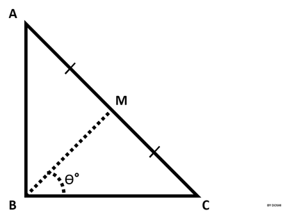

# Find Angle MBC [⬀](https://www.hackerrank.com/challenges/find-angle)



`ABC` is a right triangle, `90°` at B.

Therefore, `∡ABC = 90°`.

Point `M` is the midpoint of hypotenuse `AC`.

You are given the lengths `AB` and `BC`.

Your task is to find `∡MBC` (angle `θ°`, as shown in the figure) in degrees.

## Input Format

- The first line contains the length of side `AB`.
- The second line contains the length of side `BC`.

## Constraints

- `0 < AB ≤ 100`
- `0 < BC ≤ 100`
- Lengths `AB` and `BC` are natural numbers.

## Output Format

- Output `∡MBC` in degrees.

**Note:** Round the angle to the nearest integer.

## Examples:

- If angle is `56.5000001°`, then output **`57°`**.
- If angle is `56.5000000°`, then output **`57°`**.
- If angle is `56.4999999°`, then output **`56°`**.

## Sample Input
```
10
10
```

## Sample Output
```
45°
```
