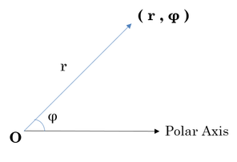

# Polar Coordinates [⬀](https://www.hackerrank.com/challenges/polar-coordinates)

**Polar coordinates** are an alternative way of representing Cartesian coordinates or [Complex Numbers](https://en.wikipedia.org/wiki/Complex_number).

A complex number `z`
```
z = x + yj
```

is completely determined by its real part `x` and imaginary part `y`.

Here, `j` is the [imaginary unit](https://en.wikipedia.org/wiki/Imaginary_unit).



A polar coordinate `(r, φ)` is completely determined by modulus `r` and phase angle `φ`.

If we convert complex number `z` to its polar coordinate, we find:
- `r`: Distance from  to origin, i.e., `√x² + y²`
- `φ`: Counter clockwise angle measured from the positive `x`-axis to the line segment that joins `z` to the origin.

Python's [cmath](https://docs.python.org/2/library/cmath.html) module provides access to the mathematical functions for complex numbers.

### cmath.phase

This tool returns the phase of complex number `z` (also known as the argument of `z`).
```
>>> phase(complex(-1.0, 0.0))
3.1415926535897931
```

### abs

This tool returns the modulus (absolute value) of complex number `z`.
```
>>> abs(complex(-1.0, 0.0))
1.0
```

## Task
You are given a complex `z`. Your task is to convert it to polar coordinates.

## Input Format

A single line containing the complex number `z`. Note: `complex()` function can be used in python to convert the input as a complex number.

## Constraints

Given number is a valid complex number

## Output Format

Output two lines:
- The first line should contain the value of `r`.
- The second line should contain the value of `φ`.

## Sample Input
```
  1+2j
```

## Sample Output
```
 2.23606797749979 
 1.1071487177940904
```

**Note:** The output should be correct up to 3 decimal places.
