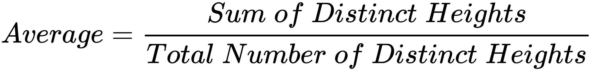
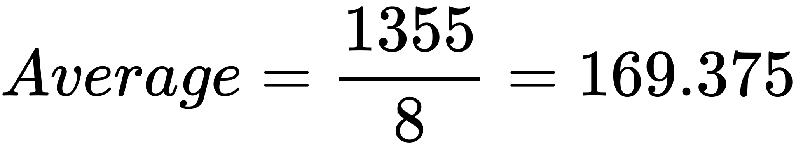

# Introduction to Sets [⬀](https://www.hackerrank.com/challenges/py-introduction-to-sets)

A set is an unordered collection of elements without duplicate entries.
When printed, iterated or converted into a sequence, its elements will appear in an arbitrary order.

## Example
```
>>> print set()
set([])

>>> print set('HackerRank')
set(['a', 'c', 'e', 'H', 'k', 'n', 'r', 'R'])

>>> print set([1,2,1,2,3,4,5,6,0,9,12,22,3])
set([0, 1, 2, 3, 4, 5, 6, 9, 12, 22])

>>> print set((1,2,3,4,5,5))
set([1, 2, 3, 4, 5])

>>> print set(set(['H','a','c','k','e','r','r','a','n','k']))
set(['a', 'c', 'r', 'e', 'H', 'k', 'n'])

>>> print set({'Hacker' : 'DOSHI', 'Rank' : 616 })
set(['Hacker', 'Rank'])

>>> print set(enumerate(['H','a','c','k','e','r','r','a','n','k']))
set([(6, 'r'), (7, 'a'), (3, 'k'), (4, 'e'), (5, 'r'), (9, 'k'), (2, 'c'), (0, 'H'), (1, 'a'), (8, 'n')])
```

Basically, sets are used for membership testing and eliminating duplicate entries.

## Task

Now, let's use our knowledge of sets and help Mickey.

Ms. Gabriel Williams is a botany professor at District College. One day, she asked her student Mickey to compute the average of all the plants with distinct heights in her greenhouse.

Formula used:



## Function Description

Complete the `average` function in the editor below.

`average` has the following parameters:

- `int arr`: an array of integers

## Returns

- `float`: the resulting float value rounded to 3 places after the decimal

## Input Format

- The first line contains the integer, `N`, the size of `arr`.
- The second line contains the `N` space-separated integers, `arr[i]`.

## Constraints

- `0 < N ≤ 100`


## Sample Input
```
STDIN                                       Function
-----                                       --------
10                                          arr[] size N = 10
161 182 161 154 176 170 167 171 170 174     arr = [161, 181, ..., 174]
```

## Sample Output
```
169.375
```

## Explanation

Here, `set([161, 182, 161, 154, 176, 170, 167, 171, 170, 174])` is the set containing the distinct heights. Using the sum() and len() functions, we can compute the average.

