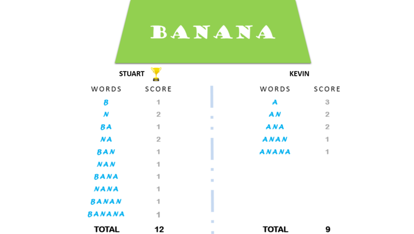

# The Minion Game [⬀](https://www.hackerrank.com/challenges/the-minion-game)

Kevin and Stuart want to play the '**The Minion Game**'.

## Game Rules

- Both players are given the same string, `S`.
- Both players have to make substrings using the letters of the string `S`.
- Stuart has to make words starting with consonants.
- Kevin has to make words starting with vowels.
- The game ends when both players have made all possible substrings.

## Scoring
A player gets `+1` point for each occurrence of the substring in the string `S`.

## For Example:

String `S = BANANA`

Kevin's vowel beginning `word = ANA`

Here, `ANA` occurs twice in `BANANA`. Hence, Kevin will get 2 Points.

For better understanding, see the image below:



Your task is to determine the winner of the game and their score.

## Function Description

Complete the minion_game in the editor below.

`minion_game` has the following parameters:

- `string string`: the string to analyze

## Prints

`string`: the winner's name and score, separated by a space on one line, or `Draw` if there is no winner

## Input Format

A single line of input containing the string `S`.

**Note:** The string `S` will contain only uppercase letters: `[A - Z]`.

## Constraints

- `0 ≤ len(S) ≤ 10⁶`

## Sample Input
```
BANANA
```

## Sample Output
```
Stuart 12
```

**Note :**

Vowels are only defined as `AEIOU`. In this problem, `Y` is not considered a 
vowel.
