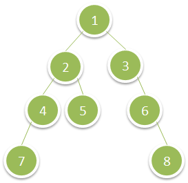

# [Deepest Leaves Sum](https://leetcode.com/problems/deepest-leaves-sum/)

Given the `root` of a binary tree, return *the sum of values of its deepest leaves*.
 

### Example 1:

```
Input: root = [1,2,3,4,5,null,6,7,null,null,null,null,8]
Output: 15
```

### Example 2:
```
Input: root = [6,7,8,2,7,1,3,9,null,1,4,null,null,null,5]
Output: 19
``` 

### Constraints:

- The number of nodes in the tree is in the range `[1, 10⁴]`.
- `1 <= Node.val <= 100`
