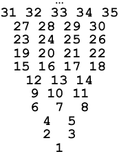

# [Strange Tower](http://acm.mipt.ru/judge/problems.pl?problem=051&lang=en)

_Time limit = 5 second(s)_

The strange tower have infinite number of stores and rooms. The first store has one room, next two stores have two rooms each, next three stores have three rooms each, ...

The tower is provided with lift. But inhabitants enconter the following problem: how to get store number and room position on the store given room number?

**Input** Room number N. 1 ≤ N ≤ 2 000 000 000.

**Output.** Two integers delimited with space: store number and order number from the left.

| Input#1  | Output#1 |
|----------|----------|
| 1        | 1 1      |

| Input#2  | Output#2 |
|----------|----------|
| 5        | 3 2      |

| Input#3  | Output#3 |
|----------|----------|
| 8        | 4 3      |

