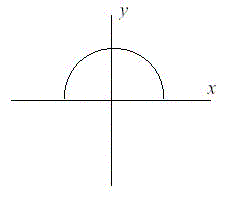

# I Think I Need a Houseboat [⬀](http://poj.org/problem?id=1005)

## Description

Fred Mapper is considering purchasing some land in Louisiana to build his house on. In the process of 
investigating the land, he learned that the state of Louisiana is actually shrinking by 50 square miles 
each year, due to erosion caused by the Mississippi River. Since Fred is hoping to live in this house 
the rest of his life, he needs to know if his land is going to be lost to erosion.

After doing more research, Fred has learned that the land that is being lost forms a semicircle. This 
semicircle is part of a circle centered at (0,0), with the line that bisects the circle being the `X` 
axis. Locations below the `X` axis are in the water. The semicircle has an area of 0 at the beginning of 
year 1. (Semicircle illustrated in the Figure.)



## Input

The first line of input will be a positive integer indicating how many data sets will be included (`N`). 
Each of the next `N` lines will contain the `X` and `Y` Cartesian coordinates of the land Fred is considering. 
These will be floating point numbers measured in miles. The `Y` coordinate will be non-negative. `(0,0)` 
will not be given.

## Output

For each data set, a single line of output should appear. This line should take the form of: “`Property 
N: This property will begin eroding in year Z.`” Where `N` is the data set (counting from 1), and `Z` is the 
first year (start from 1) this property will be within the semicircle AT THE END OF YEAR `Z`. `Z` must be an 
integer. After the last data set, this should print out “`END OF OUTPUT.`”

## Sample Input
```
2
1.0 1.0
25.0 0.0
```

## Sample Output
```
Property 1: This property will begin eroding in year 1.
Property 2: This property will begin eroding in year 20.
END OF OUTPUT.
```

## Hint

1.No property will appear exactly on the semicircle boundary: it will either be inside or outside.

2.This problem will be judged automatically. Your answer must match exactly, including the capitalization,
punctuation, and white-space. This includes the periods at the ends of the lines.

3.All locations are given in miles.

## Source

Mid-Atlantic 2001
