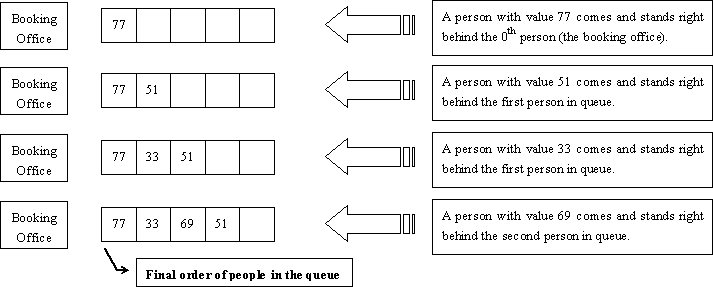

# [Buy Tickets](http://poj.org/problem?id=2828)

## Description

*Railway tickets were difficult to buy around the Lunar New Year in China, so we must get up early and join a long queue…*

The Lunar New Year was approaching, but unluckily the Little Cat still had schedules going here and there. Now, he had to travel by train to Mianyang, Sichuan Province for the winter camp selection of the national team of Olympiad in Informatics.

It was one o’clock a.m. and dark outside. Chill wind from the northwest did not scare off the people in the queue. The cold night gave the Little Cat a shiver. Why not find a problem to think about? That was none the less better than freezing to death!

People kept jumping the queue. Since it was too dark around, such moves would not be discovered even by the people adjacent to the queue-jumpers. “If every person in the queue is assigned an integral value and all the information about those who have jumped the queue and where they stand after queue-jumping is given, can I find out the final order of people in the queue?” Thought the Little Cat.

## Input

There will be several test cases in the input. Each test case consists of `N + 1` lines where `N` (`1 ≤ N ≤ 200,000`) is given in the first line of the test case. The next `N` lines contain the pairs of values `Posᵢ` and `Valᵢ` in the increasing order of `i` (`1 ≤ i ≤ N`). For each `i`, the ranges and meanings of `Posᵢ` and `Valᵢ` are as follows:

- `Posᵢ ∈ [0, i − 1]` — The `i`-th person came to the queue and stood right behind the Posi-th person in the queue. The booking office was considered the 0th person and the person at the front of the queue was considered the first person in the queue.
- `Valᵢ ∈ [0, 32767]` — The `i`-th person was assigned the value `Valᵢ`.

There no blank lines between test cases. Proceed to the end of input.

## Output

For each test cases, output a single line of space-separated integers which are the values of people in the order they stand in the queue.

### Sample Input
```
4
0 77
1 51
1 33
2 69
4
0 20523
1 19243
1 3890
0 31492
```

### Sample Output
```
77 33 69 51
31492 20523 3890 19243
```

### Hint

The figure below shows how the Little Cat found out the final order of people in the queue described in the first test case of the sample input.




## Source

POJ Monthly--2006.05.28, Zhu, Zeyuan
