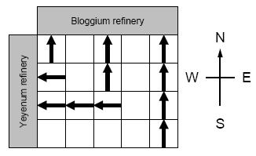

# Martian Mining [⬀](http://poj.org/problem?id=2948)

## Description

The NASA Space Center, Houston, is less than 200 miles from San Antonio, Texas (the site of the ACM Finals this year). This is the place where the astronauts are trained for Mission Seven Dwarfs, the next giant leap in space exploration. The Mars Odyssey program revealed that the surface of Mars is very rich in yeyenum and bloggium. These minerals are important ingredients for certain revolutionary new medicines, but they are extremely rare on Earth. The aim of Mission Seven Dwarfs is to mine these minerals on Mars and bring them back to Earth.

The Mars Odyssey orbiter identified a rectangular area on the surface of Mars that is rich in minerals. The area is divided into cells that form a matrix of `n` rows and `m` columns, where the rows go from east to west and the columns go from north to south. The orbiter determined the amount of yeyenum and bloggium in each cell. The astronauts will build a yeyenum refinement factory west of the rectangular area and a bloggium factory to the north. Your task is to design the conveyor belt system that will allow them to mine the largest amount of minerals.

There are two types of conveyor belts: the first moves minerals from east to west, the second moves minerals from south to north. In each cell you can build either type of conveyor belt, but you cannot build both of them in the same cell. If two conveyor belts of the same type are next to each other, then they can be connected. For example, the bloggium mined at a cell can be transported to the bloggium refinement factory via a series of south-north conveyor belts.

The minerals are very unstable, thus they have to be brought to the factories on a straight path without any turns. This means that if there is a south-north conveyor belt in a cell, but the cell north of it contains an east-west conveyor belt, then any mineral transported on the south-north conveyor beltwill be lost. The minerals mined in a particular cell have to be put on a conveyor belt immediately, in the same cell (thus they cannot start the transportation in an adjacent cell). Furthermore, any bloggium transported to the yeyenum refinement factory will be lost, and vice versa.



Your program has to design a conveyor belt system that maximizes the total amount of minerals mined,i.e., the sum of the amount of yeyenum transported to the yeyenum refinery and the amount of bloggium transported to the bloggium refinery.

## Input

The input contains several blocks of test cases. Each case begins with a line containing two integers: the number `1 ≤ n ≤ 500` of rows, and the number `1 ≤ m ≤ 500` of columns. The next n lines describe the amount of yeyenum that can be found in the cells. Each of these n lines contains m integers. The first line corresponds to the northernmost row; the first integer of each line corresponds to the westernmost cell of the row. The integers are between 0 and 1000. The next n lines describe in a similar fashion theamount of bloggium found in the cells.

The input is terminated by a block with `n = m = 0`.

## Output

For each test case, you have to output a single integer on a separate line: the maximum amount of mineralsthat can be mined.

### Sample Input
```
4 4
0 0 10 9
1 3 10 0
4 2 1 3 
1 1 20 0
10 0 0 0
1 1 1 30
0 0 5 5
5 10 10 10
0 0
```

### Sample Output
```
98
```

## Hint

Huge input file, 'scanf' recommended to avoid TLE.

## Source

Central Europe 2005
