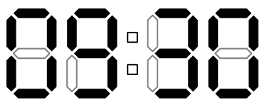
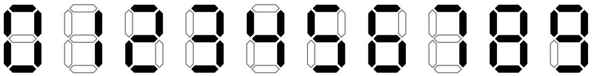

# Alarm Clock

Alice likes her digital alarm clock. She sets 
them up every evening. Last night Alice had a
dream about her clock. Unfortunately, the only
thing she is able to remember is the number of
highlighted segments of the clock. Alice 
wonders what time was set on the clock in her 
dream.

Alice’s clock have four digits: two for hours
and two for minutes. For example, the clock 
below shows 9:30 (note the leading zero).

The clock uses following digit representation.

## Input

The only line of the input file contains single 
integer n — the number of highlighted segments 
of the clock in Alice’s dream (0 ≤ n ≤ 30).

## Output

Output five characters in “hh:mm” format — the 
time shown on the clock in Alice’s dream. The 
time must be correct: 0 ≤ hh < 24 and 0 ≤ mm < 
60. If there are many possible correct times, 
output any of them. If there is none, output 
“Impossible”.

## Examples

| alarm.in | alarm.out |
|----------|-----------|
| 23       | 09:30     |
| 28       | Impossible|
| 2        | Impossible|
